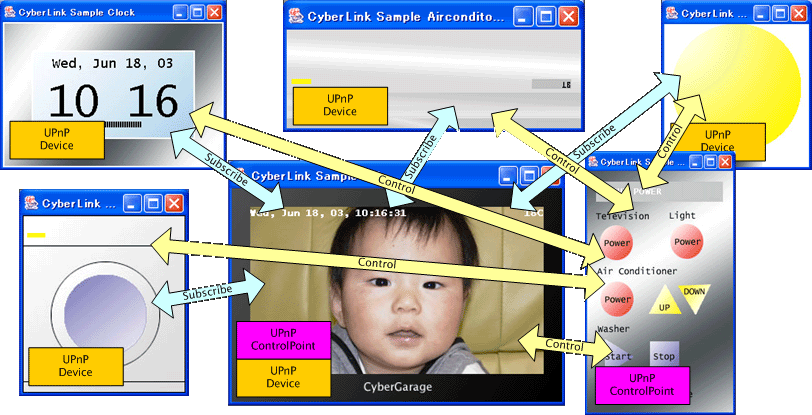
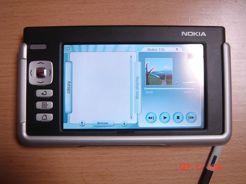
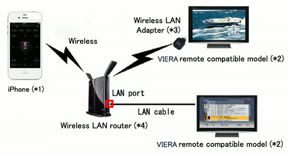

# mUPnP for C

## Overview

mUPnP for C is a development package for UPnP™ developers. mUPnP
controls these protocols automatically, and supports to create your
devices and control points quickly.

UPnP™ \* architecture is an open network to enable discovery and control
of networked devices and services, such as media servers and players at
home.

UPnP™ \* protocols are based on many standard, such as GENA, SSDP, SOAP,
HTTPU and HTTP. Therefore you have to understand and implement these
protocols to create your devices of UPnP™.



mUPnP for C is supported from IPA, INFORMATION-TECHNOLOGY PROMOTION
AGENCY, JAPAN, as a project of MitohProgram2004.

\* UPnP ™ is a certification mark of the UPnP™ Implementers Corporation.

## Repositories

The project is hosted on the following sites. Please check the following
sites to know about mUPnP for C in more detail.

* [Programming Guide](http://www.cybergarage.org:8080/pdfdoc/clinkcproguide.pdf)
* [Doxygen](http://www.cybergarage.org:8080/doxygen/mupnp4c/)
* [GitHub](https://github.com/cybergarage/mupnpc)

Adoption
--------
### Nokia 770 Internet Tablet

Nokia released the UPnP/AV Control point, Media Streamer, for Nokia 770.
The control point is created based on CyberLinkForC with their patches.



### Panasonic VIERA remote for iPhone / iPod touch / iPad

[VIERA remote](http://panasonic.jp/support/global/cs/tv/vremote/index.html) is a TV remote controller app for Panasonic VIERA TVs, both plasma TV and
LCD TV, to let TV channel selection, input selection and volume control
from iPhone / iPod touch / iPad (of iOS 4.2 or later). CyberLinkForJava
is used as the UPnP framework.



## Support

### upnpchk

If you have any problems using mUPnP, please use the tiny debugging
tool which is included in Net::UPnP, and send the output log as
the following. To run the debugging tool, you have to be able to run
Perl on your computer.

```
$ tar xvf <Net-UPnP-?.?.?.tar>
$ cd <Net-UPnP-?.?.?>
$ perl -Ilib examples/upnpchk.pl > upnpchk.log
```
